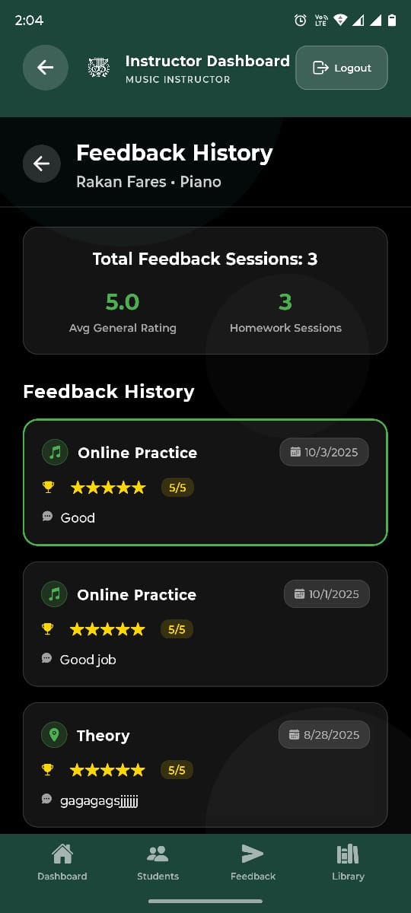
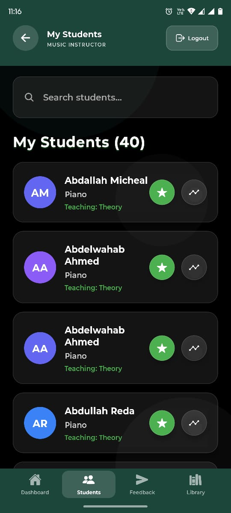

# 🎵 Tchaikovsky School Mobile App

A mobile application for music instructors to manage students, provide feedback, and track progress.

## Screenshots

  
  
  
  
  

## Tech Stack

- React Native with Expo
- TypeScript

## Features

- Student management
- Session feedback with ratings
- Progress tracking
- Sheet music library
- Feedback history

## Created By

Mohammed Mahmoud :)
