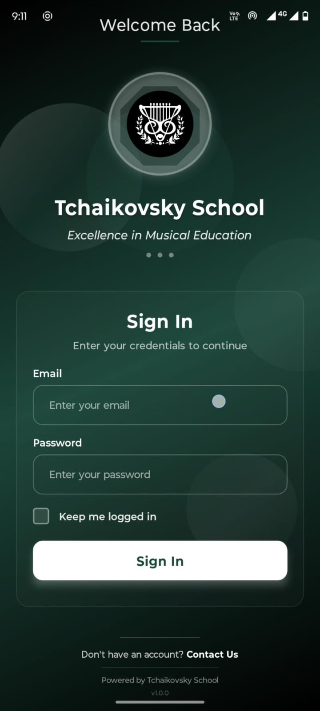
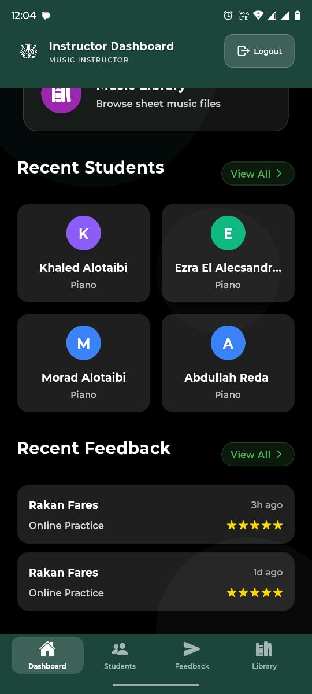

# 🎵 Tchaikovsky School Mobile App

A mobile application for music instructors to manage students, provide feedback, and track progress.

## Screenshots

<div align="center">
  
  
  
  
  
</div>

## Tech Stack

- React Native with Expo
- TypeScript

## Installation

```bash
# Install dependencies
npm install

# Start the app
npx expo start
```

## Features

- Student management
- Session feedback with ratings
- Progress tracking
- Sheet music library
- Feedback history

## License

MIT
